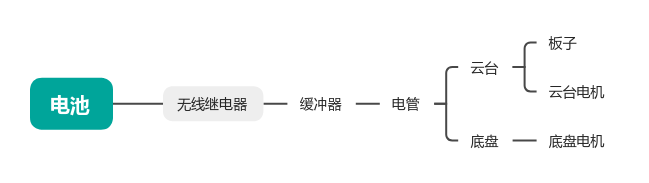

# 工程日志记录

## 1.5

1.添加了5号电机同步控制

添加六号电机开关夹取

七个电机can2带不动——分三个给can3

现存：似乎分电板没焊好，换一块或重新焊——解决

导电滑环焊接

信号线：

串口7板间通讯*3

云台can*2

裁判系统*4

## 1.6

跑通底盘

电调红灯常亮，看3508说明书，7pin线有问题，换了新的就好了

持续输出角度值，原因未知

焊导电滑环

电源接线

## 1.7

修复底盘问题

底盘持续转动原因——积分IOUT未清零，保持max2000值计算pidout，导致持续转动

上部机械臂调试

先调试下3电机

问题描述：在分两路can 的老分电板上，can3老是发送失败（或不发送），can2正常；或者can2有问题，can3正常，反正总有一个有问题

解决：只要电源与can线在一块板子上就会发生，所以信号线与电源线分两块板

注意can线的末端电阻

## 1.8

2.大yaw固定朝向（有点问题，有时候没反应，得按复位才行

原因：固件版本太老

3.翻转了机械臂，记得改参数；

问题：灵足两个00，位置会突变

## 1.9

1.自定义控制器添加按钮

添加零点保护，零点在正确范围内才使能

## 1.10

1.刷新灵足驱动固件

将3.6刷成3.22，固件太老了不响应新协议

Rs00更新固件后刷id失败：恢复出厂后重新刷，成功

rs00电机，在0-4π间上电零点正常，在0-（-4π）上电会变0位置，所以在大yaw朝向车体左侧上电

## 1.11

没干活

## 1.12

重校零点

添加自定义控制器掉线标志位，掉线不进行控制

添加重力补偿

关节1（j0）：绕垂直轴的旋转，重力不产生绕z轴的力矩

T1	=	0

关节2（j1）零位置：竖直向上

T2 	=	F2L2/2

F2	=	(mj1Gsinθ1

关节3（j2）零位置：沿j1臂方向（即与j1共线）

关节4（j3）零位置：轴向正视j2时钟0刻度位置

关节5（j4）零位置：沿j3臂方向（即与j3共线）

已添加待测试

## 1.13

0.添加电机初始位置正常检测

拍视频

睡觉

焊好db9rs232转接口

## 1.14

用vofa查看自定义控制器数据曲线

曲线响应相对及时，但波形是阶梯状，不是柔滑曲线

去掉一阶线性滤波

Task频率疑似只有10hz不到，用定时器测试一下

如果真是这么低频，问题就出在task上1

测试结果servo_task函数只有9hz，原因是其优先级被设置为最低，修改为实时优先级后，变成了600hz

测试：osPriorityIdle优先级下，ROBOT_TASK任务仅有9帧，而osPriorityHigh优先级下，有1005帧

## 1.15

团建

## 1.16

解决控制延时问题

当前角度采集速率：333hz

发送速率：1000hz
